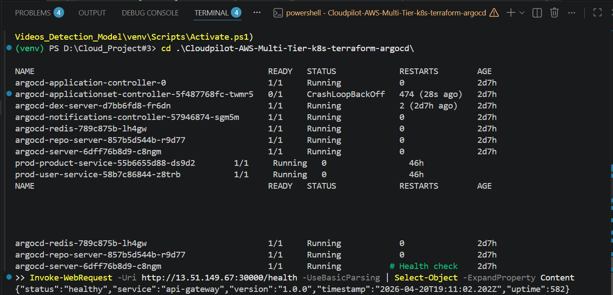
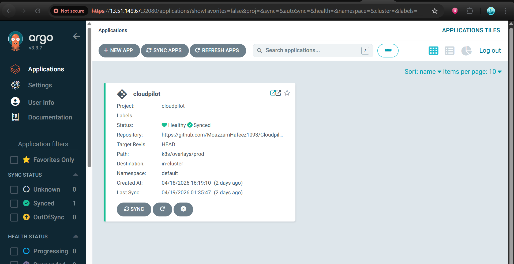
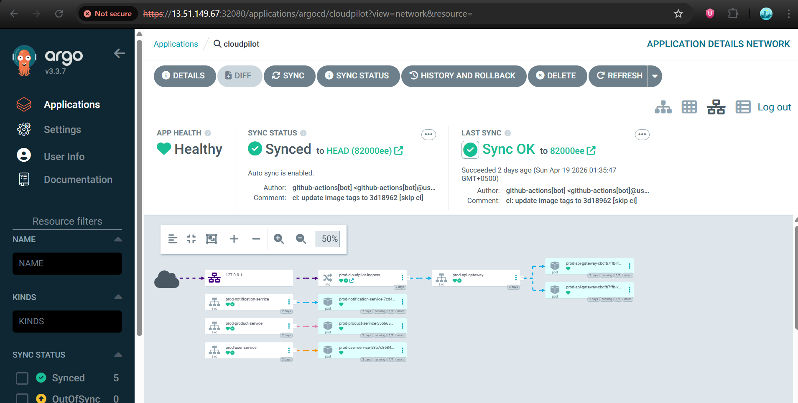
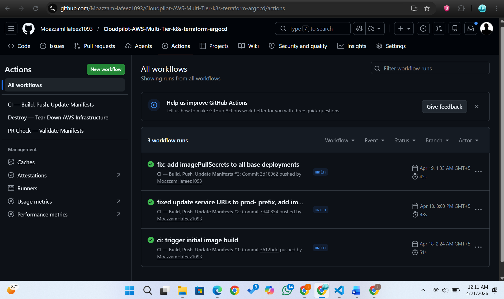
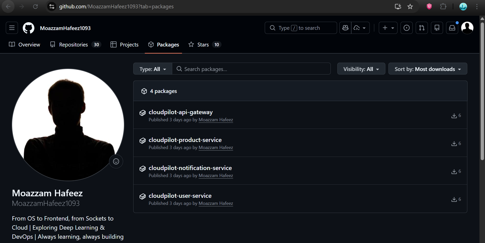
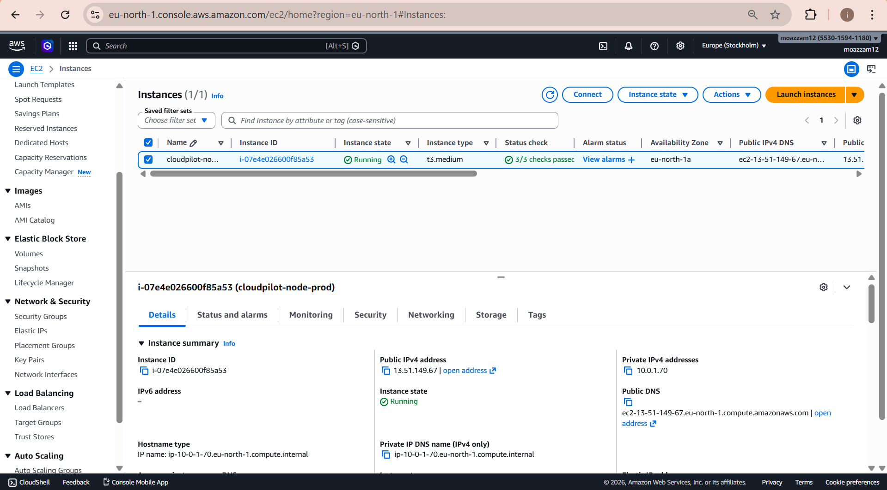
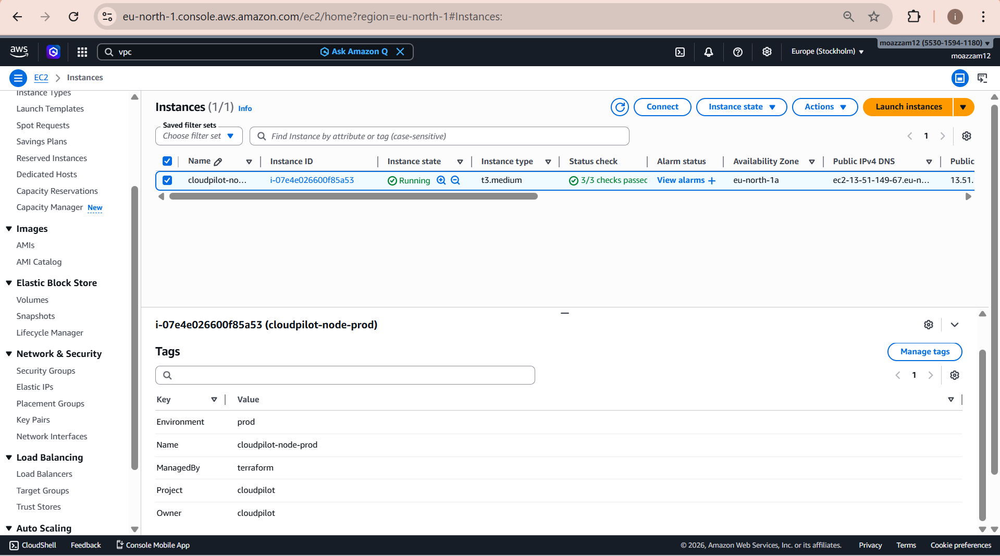
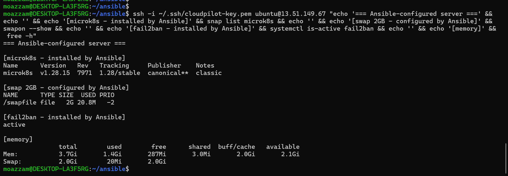
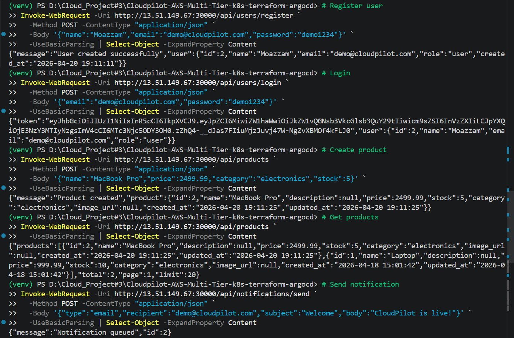
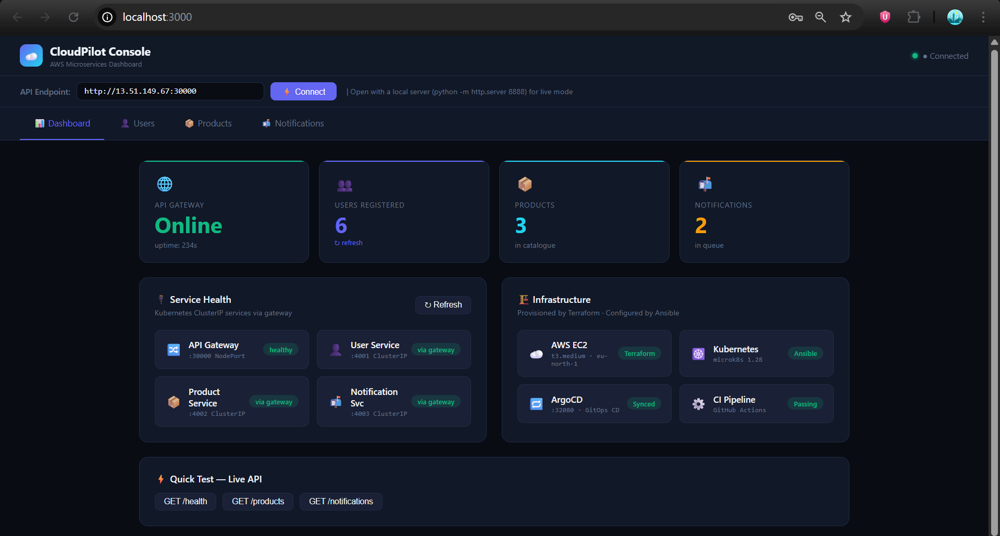

<div align="center">


<br/>

# ☁️ CloudPilot

### Production-Grade Multi-Tier Microservices — Deployed on AWS

*Built from scratch. Every line of infrastructure is code. Every deployment is automatic.*

<br/>

[](https://github.com/MoazzamHafeez1093/Cloudpilot-AWS-Multi-Tier-k8s-terraform-argocd/actions/workflows/ci.yml)


<br/>

> **`git push` → 60 seconds → live on AWS. Every time. Automatically.**

<br/>

</div>

---

## 📌 What Is CloudPilot?

CloudPilot is a **complete, production-grade DevOps project** — not a tutorial, not a mock deployment. Real AWS infrastructure, real Kubernetes cluster, real CI/CD pipeline firing on every commit.

It covers the **entire DevOps lifecycle**:

```
Write Code → Containerize → Provision Infrastructure → Configure Server
     → Orchestrate with Kubernetes → Automate CI → GitOps CD with ArgoCD
```

> Tear down the infra, run two commands — it's back up exactly as before.

---

## 🏗️ System Architecture

```
                        Internet
                            │
                    HTTP :30000 (NodePort)
                            │
         ┌──────────────────▼──────────────────────┐
         │   AWS EC2  t3.medium  ·  eu-north-1       │
         │   Ubuntu 22.04  ·  Elastic IP             │
         │   EBS 20 GB gp3 encrypted                 │
         │                                           │
         │  ┌─────────────────────────────────────┐  │
         │  │      microk8s Kubernetes Cluster     │  │
         │  │                                     │  │
         │  │   ┌──────────────────────────────┐  │  │
         │  │   │       API Gateway :3000       │  │  │
         │  │   │   NodePort :30000  (public)   │  │  │
         │  │   └────────────┬─────────────────┘  │  │
         │  │                │ ClusterIP only      │  │
         │  │       ┌────────┼────────┐            │  │
         │  │       ▼        ▼        ▼            │  │
         │  │   user:4001  prod:4002  notify:4003  │  │
         │  │   SQLite/PVC SQLite/PVC SQLite/PVC   │  │
         │  │                                     │  │
         │  │   ArgoCD :32080  ← GitOps engine    │  │
         │  └─────────────────────────────────────┘  │
         │                                           │
         │  VPC 10.0.0.0/16 → Subnet 10.0.1.0/24    │
         │  IGW → Route Table → Security Group       │
         │  Ports: 22, 80, 443, 30000-32767          │
         └───────────────────────────────────────────┘
```

---

## 🔄 CI/CD Pipeline — Push to Live in 60 Seconds

```
  Developer
     │
     │  git push origin main
     ▼
  GitHub ──────────────────────────────────────────────────────┐
     │  Trigger: services/** or k8s/** changed                  │
     ▼                                                          │
  GitHub Actions CI                                             │
     │                                                          │
     ├─ [matrix] Build api-gateway    → ghcr.io/:sha           │
     ├─ [matrix] Build user-service   → ghcr.io/:sha           │
     ├─ [matrix] Build product-service → ghcr.io/:sha          │
     ├─ [matrix] Build notify-service → ghcr.io/:sha           │
     │                                                          │
     ├─ Kustomize: update image tags in k8s/overlays/prod/      │
     └─ git commit [skip ci] + push ───────────────────────────┘
                                                │
                                    ArgoCD polls every 3 min
                                                │
                                                ▼
                                      Kubernetes Rolling Update
                                   maxSurge: 1 · maxUnavailable: 0
                                                │
                                                ▼
                                         ✅  Live on AWS
                                        ~60 seconds total
```

| Stage | Tool | What Happens |
|-------|------|-------------|
| **Trigger** | GitHub | Push to `main` on `services/**` or `k8s/**` |
| **Build** | GitHub Actions | 4 Docker images built in parallel (matrix strategy) |
| **Push** | ghcr.io | Images tagged with git SHA, pushed to registry |
| **Update** | Kustomize | Image tags patched in `k8s/overlays/prod/` |
| **Detect** | ArgoCD | Polls repo every 3 min, detects new commit |
| **Deploy** | Kubernetes | Rolling update — zero downtime |

---

## 🛠️ Technology Stack

| Layer | Technology | Detail |
|-------|-----------|--------|
| ☁️ **Cloud** | AWS EC2 · VPC · EIP · SG · IAM | eu-north-1 · t3.medium · encrypted EBS |
| 🏗️ **IaC** | Terraform 1.14 | 9 resources · tagged · state-managed |
| ⚙️ **Config** | Ansible — 4 roles | common · hardening · microk8s · argocd |
| 🐳 **Containers** | Docker multi-stage | Non-root user · HEALTHCHECK · OCI labels |
| ☸️ **Orchestration** | microk8s 1.28 | dns · storage · ingress · registry addons |
| 🔁 **GitOps CD** | ArgoCD v3.3 | Auto-sync · selfHeal · prune |
| ⚡ **CI** | GitHub Actions | Matrix builds · layer caching |
| 📦 **Registry** | ghcr.io | Free · repo-scoped · SHA-tagged |
| 🟢 **Runtime** | Node.js + Express | 4 independent microservices |
| 🗄️ **Database** | SQLite per service | PersistentVolumeClaims · no shared DB |
| ✅ **Validation** | Zod | Runtime type safety on all API inputs |
| 🔐 **Auth** | JWT + bcrypt | 24 h expiry · 12-round hashing |

---

## 📦 Microservices

<details>
<summary><b>🔀 API Gateway — port 3000 · NodePort :30000 (only public-facing service)</b></summary>
<br/>

The single entry point. Nothing reaches the backend directly.

| Feature | Detail |
|---------|--------|
| Rate limiting | 100 req / 15 min / IP |
| Security headers | helmet middleware |
| Proxy | http-proxy-middleware **pinned to v2.0.6** (v3 broke `pathRewrite`) |
| Health probe | `GET /health` → liveness + readiness |
| CORS | Explicit allowlist — browser safe |

</details>

<details>
<summary><b>👤 User Service — port 4001 · ClusterIP (internal only)</b></summary>
<br/>

Full authentication system with production-grade security.

| Endpoint | Description |
|----------|-------------|
| `POST /users/register` | Zod validation · bcrypt 12 rounds · duplicate detection |
| `POST /users/login` | Timing-attack resistant · JWT 24 h expiry |
| `GET /users/me` | JWT-protected route |
| `GET /users/health` | Returns registered user count |

SQLite on PersistentVolumeClaim — data survives pod restarts.

</details>

<details>
<summary><b>📦 Product Service — port 4002 · ClusterIP (internal only)</b></summary>
<br/>

Full product catalogue with search and pagination.

| Endpoint | Description |
|----------|-------------|
| `GET /products` | Pagination · search · category filter |
| `POST /products` | Create with Zod validation |
| `PUT /products/:id` | Partial update |
| `DELETE /products/:id` | With existence check |

Parameterised queries throughout — SQL injection proof.

</details>

<details>
<summary><b>📬 Notification Service — port 4003 · ClusterIP (internal only)</b></summary>
<br/>

Async dispatch with production-grade reliability.

| Feature | Detail |
|---------|--------|
| Response | `202 Accepted` immediately — never blocks caller |
| Queue | `pending → processing → sent / failed` |
| Retry | Auto-retry up to 3 attempts |
| Manual retry | `POST /notifications/:id/retry` |
| Transport | SMTP via nodemailer · config via Kubernetes Secret |

</details>

---

## 📁 Project Structure

```
Cloudpilot-AWS-Multi-Tier-k8s-terraform-argocd/
│
├── 🐳 services/
│   ├── api-gateway/            # Rate limiting · proxy · security headers
│   ├── user-service/           # JWT auth · bcrypt · SQLite
│   ├── product-service/        # CRUD · pagination · search
│   ├── notification-service/   # Async email queue · retry logic
│   ├── frontend/               # Single-file HTML dashboard
│   └── */Dockerfile            # Multi-stage · non-root · HEALTHCHECK · OCI labels
│
├── ☸️ k8s/
│   ├── base/
│   │   ├── */deployment.yaml   # Resources · liveness/readiness probes · imagePullSecrets
│   │   ├── */service.yaml      # ClusterIP internal / NodePort for gateway
│   │   ├── */configmap.yaml    # Non-sensitive env vars
│   │   ├── */secret.yaml       # JWT secret · SMTP credentials (base64)
│   │   ├── */pvc.yaml          # Persistent storage per service
│   │   ├── ingress/            # Nginx ingress routing
│   │   └── kustomization.yaml  # Ties all resources together
│   └── overlays/
│       ├── prod/               # ← ArgoCD watches this path · namePrefix: prod-
│       └── dev/
│
├── 🏗️ infra/
│   ├── terraform/
│   │   ├── main.tf             # VPC · EC2 · SG · EIP · IAM · auto-inventory
│   │   ├── variables.tf        # Region · instance type · CIDRs · key paths
│   │   ├── outputs.tf          # IP · SSH command · app URL · ArgoCD URL
│   │   └── inventory.tpl       # Auto-generates Ansible hosts.ini
│   └── ansible/
│       ├── playbooks/site.yml  # Master playbook — runs all 4 roles
│       └── roles/
│           ├── common/         # apt packages · 2 GB swap · timezone UTC
│           ├── hardening/      # fail2ban · sshd hardening · auto-updates
│           ├── microk8s/       # snap install · addons: dns storage ingress registry
│           └── argocd/         # install · NodePort patch · AppProject · Application
│
├── 🔁 argocd/
│   ├── application.yaml        # Repo · path · auto-sync · selfHeal · prune
│   ├── project.yaml            # AppProject RBAC — source repos · destinations
│   └── notifications.yaml      # Deploy / fail / degrade alerts
│
├── ⚙️ .github/workflows/
│   ├── ci.yml                  # Matrix build → push → kustomize update → commit
│   ├── pr-check.yml            # kubeval + kustomize build on every PR
│   └── destroy.yml             # Manual teardown with DESTROY confirmation gate
│
├── docker-compose.yml          # Full local dev stack with healthcheck depends_on
└── .env.example                # All required env vars documented
```

---

## 🖥️ Live Proof — Everything Running on AWS

### All Kubernetes Pods Running



---

### ArgoCD — Synced and Healthy





---

### GitHub Actions — CI Green





---

### AWS Infrastructure — Running




---

### Terraform Tags — Infrastructure as Code Proof



---

### Ansible — Server Configuration Proof



---

### API Endpoints — Live Testing



---

### Frontend Dashboard



---

## 🚀 Running Locally

```bash
# Clone
git clone https://github.com/MoazzamHafeez1093/Cloudpilot-AWS-Multi-Tier-k8s-terraform-argocd.git
cd Cloudpilot-AWS-Multi-Tier-k8s-terraform-argocd

# Configure environment
cp .env.example .env

# Start all 4 services + gateway
docker compose up --build

# Verify
curl http://localhost:3000/health
# → {"status":"healthy","service":"api-gateway","uptime":...}
```

> All traffic goes through the gateway at `:3000`. Individual services are not exposed.

---

## ☁️ Deploying to AWS

### Prerequisites

```
✅  AWS account + CLI configured  (aws configure)
✅  Terraform >= 1.6
✅  Ansible  (Linux or WSL on Windows — see note below)
✅  SSH key at ~/.ssh/cloudpilot-key.pem
✅  GitHub PAT with write:packages scope
```

> ⚠️ **Windows users:** Run Ansible from **WSL** (`~/ansible/`), not from the Windows filesystem mount. WSL treats Windows mounts as world-writable, causing Ansible to silently ignore `ansible.cfg`.

---

### Step 1 — Provision with Terraform

```bash
cd infra/terraform
terraform init
terraform plan
terraform apply
```

Terraform outputs everything you need:

```
instance_public_ip = "x.x.x.x"
app_url            = "http://x.x.x.x:30000"
argocd_url         = "http://x.x.x.x:32080"
ssh_command        = "ssh -i ~/.ssh/cloudpilot-key.pem ubuntu@x.x.x.x"
```

> The Ansible inventory (`hosts.ini`) is **auto-generated** from Terraform output. No manual IP entry.

---

### Step 2 — Configure with Ansible

```bash
cd infra/ansible
ansible-playbook playbooks/site.yml -i inventory/hosts.ini
```

One command installs and configures everything:

- ✅ System packages · 2 GB swap · UTC timezone
- ✅ SSH hardening · fail2ban · unattended upgrades
- ✅ microk8s with dns · storage · ingress · registry addons
- ✅ ArgoCD — deployed and immediately syncing from GitHub

---

### Step 3 — Image Pull Secret

```bash
kubectl create secret docker-registry ghcr-secret \
  --docker-server=ghcr.io \
  --docker-username=YOUR_GITHUB_USERNAME \
  --docker-password=YOUR_GITHUB_PAT \
  -n default
```

---

### Step 4 — Access

| Service | URL |
|---------|-----|
| **API** | `http://EC2_IP:30000` |
| **ArgoCD** | `http://EC2_IP:32080` |
| **Frontend** | `cd services/frontend && python -m http.server 8888` |

```bash
# Get ArgoCD admin password
kubectl -n argocd get secret argocd-initial-admin-secret \
  -o jsonpath="{.data.password}" | base64 -d
```

---

### Teardown — Stop Billing

```bash
cd infra/terraform
terraform destroy
```

Or from GitHub: **Actions → Destroy — Tear Down AWS Infrastructure → type `DESTROY`**

> 💸 Running cost: ~$1.20/day. Destroy when done.

---

## 📡 API Reference

All traffic goes through the gateway. Individual services are not publicly reachable.

```bash
# ── Health ──────────────────────────────────────────────────────────────────
GET  http://EC2_IP:30000/health
→ {"status":"healthy","service":"api-gateway","uptime":338}

# ── Users ───────────────────────────────────────────────────────────────────
POST http://EC2_IP:30000/api/users/register
{"name":"John","email":"john@example.com","password":"password123"}
→ {"message":"User created successfully","user":{...}}

POST http://EC2_IP:30000/api/users/login
{"email":"john@example.com","password":"password123"}
→ {"token":"eyJhbGci...","user":{...}}

# ── Products ─────────────────────────────────────────────────────────────────
POST http://EC2_IP:30000/api/products
{"name":"MacBook Pro","price":2499.99,"category":"electronics","stock":5}
→ {"message":"Product created","product":{...}}

GET  http://EC2_IP:30000/api/products?category=electronics&page=1&limit=10
GET  http://EC2_IP:30000/api/products?search=macbook

# ── Notifications ────────────────────────────────────────────────────────────
POST http://EC2_IP:30000/api/notifications/send
{"type":"email","recipient":"user@example.com","subject":"Hi","body":"Welcome!"}
→ {"message":"Notification queued","id":1}         # 202 Accepted
```

---

## 🔒 Security

| Area | Implementation |
|------|---------------|
| **Containers** | Non-root user (`appuser`) · multi-stage builds · no build tools in final image |
| **Network** | Internal services on ClusterIP — unreachable from internet directly |
| **Rate limiting** | 100 req / 15 min / IP at gateway |
| **Database** | Parameterised queries only — zero string concatenation |
| **Auth** | JWT 24 h expiry · bcrypt 12 rounds · timing-attack resistant login |
| **Server** | Root login disabled · password auth disabled · fail2ban active |
| **Storage** | EBS encrypted at rest · Kubernetes Secrets for credentials |
| **CI/CD** | Secrets in GitHub Secrets — never in code or ConfigMaps |

---

## ⚠️ Real Challenges Solved

These are real production-equivalent problems encountered and systematically resolved.

### 1 — `http-proxy-middleware` v3 silent breaking change

v3 silently changed `pathRewrite` behaviour. Requests arrived at services with wrong paths — gateway forwarded them but services returned 404. No error was surfaced; the failure was invisible at the gateway layer.

**Diagnosis:** Added proxy logging to capture the raw forwarded URL pre/post rewrite.
**Fix:** Pinned to `^2.0.6` in all four `package.json` files. Committed `package-lock.json`.

---

### 2 — Kustomize `namePrefix` broke internal service discovery

The prod overlay adds `prod-` to all resource names. The gateway ConfigMap still used `http://user-service:4001` — which no longer existed in DNS. Result: silent 504 timeouts with no obvious error.

**Diagnosis:** `kubectl get svc` revealed all services had been renamed with the prefix.
**Fix:** Updated ConfigMap URLs to `http://prod-user-service:4001` etc.

---

### 3 — Private ghcr.io images → `ImagePullBackOff`

Kubernetes had no credentials to pull from the private registry. Pod events showed `401 Unauthorized`.

**Fix:** Created a `docker-registry` Secret (`ghcr-secret`) and added `imagePullSecrets` to all four Deployment manifests.

---

### 4 — `npm ci` required `package-lock.json`

`npm ci` is stricter than `npm install` — it requires a lockfile. Docker builds passed locally but failed in CI because lockfiles were not committed.

**Fix:** Ran `npm install` locally in each service directory, committed the generated lockfiles.

---

### 5 — Ansible roles not found on Windows WSL mount

WSL treats Windows filesystem mounts as world-writable. Ansible's security model silently ignores `ansible.cfg` on world-writable paths — roles were not found.

**Fix:** Copied the Ansible directory to WSL home (`~/ansible/`). Added `roles_path = ./roles` to `ansible.cfg`.

---

### 6 — ArgoCD NodePort invalid range

Initial ArgoCD patch targeted port 8080 — rejected by Kubernetes (valid range: 30000–32767).
**Fix:** Patched to NodePort `32080`.

---

### 7 — CORS blocking browser dashboard requests

API Gateway was missing CORS middleware. Browsers blocked cross-origin responses.
**Fix:** Added `cors` middleware before all proxy route definitions with explicit origin and method allowlists.

---

## 📊 By the Numbers

| What | Count |
|------|-------|
| Microservices | 4 |
| Dockerfiles (multi-stage) | 4 |
| Kubernetes YAML manifests | 21 |
| Terraform resources | 9 |
| Ansible roles | 4 |
| GitHub Actions workflows | 3 |
| AWS resources provisioned | 9 (VPC · Subnet · IGW · RT · SG · EC2 · EIP · IAM Role · IAM Profile) |
| Lines of application code | ~2,500 |
| Push to live | ~60 seconds |
| Challenges solved | 10 |

---

## 👤 Author

**Moazzam Hafeez**
BS Computer Science · Final Semester · FAST NUCES Islamabad
Cloud & DevOps Engineering

[](https://github.com/MoazzamHafeez1093)
[](https://linkedin.com/in/yourlinkedin)

---

<div align="center">

*Built with persistence. Debugged with patience. Deployed with pride.*

</div>